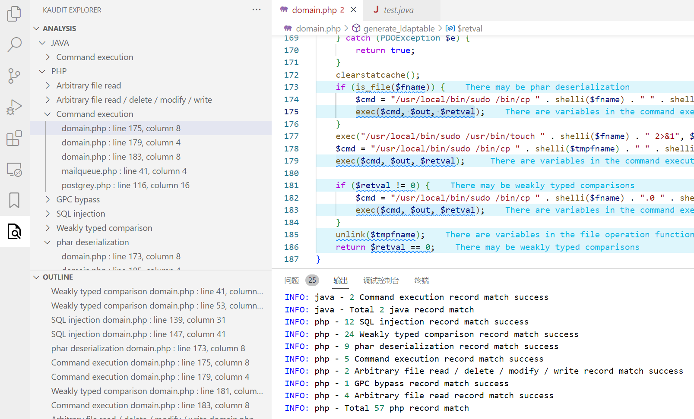
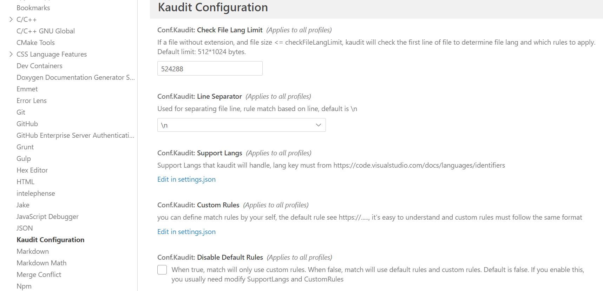

# Kaudit

> VSCode plugin,  auxiliary for source code audit

English | [简体中文](README.zh-CN.md)

## Still under development...

Something wrong in README, here content will modify when first stable version is available

## Introduction

A simple source code audit tool based on regex match

* Extension based on the `Maudit` audit rule
  * Redefine the underlying rule model
  * Supports priority ordering of rules to control the display ordering of matching results
* Based on `Maudit` design idea, reconstructs all the code, the core processing code is different from `Maudit`'s
* The default RE matching rules come from `Maudit`, but provide custom rule extensions
* Provides language and vulnerability type classification navigation
* Provides OUTLINE for per-page navigation



## Install

* Search for `kaduit` install from the VSCode store , todo
* Source installation, todo 

  ```
  git clone https://github.com/xxxxxx
  cd kaudit
  npm i
  npm install -g vsce
  vsce package
  ```

  Select the VSIX file installation from the VScode extension page menu
* It is recommended to install the `Error Lens` plug-in to display the description of the matching rule in the matching line (optional)
* It is recommended to install the `Output Colorizer` plugin. The console output will provide color differentiation (optional).

## Quick Start

Open the `php/perl/python/java` source project, click the refresh button in the upper right corner of the kaudit panel, and the workspace  analysis will begin.

> Tips:Y ou can drag and drop the tree view into the default Explorer to make it easier to browse files and match records in one panel

## Custom Rules

`CustomRules` can be defined in `Kaudit Configuration`, and `SupportLangs` support needs to be added if the rules match a language other than `php/perl/python/java`



SupportLangs Format:

```js
"conf.Kaudit.supportLangs": {   
        "java": [
            "java"
        ],
        "perl": [
            "pl",
            "pm"
        ],
        "php": [
            "php",
            "php3",
            "php4",
            "php5",
            "php6",
            "php7",
            "pht",
            "phtml"
        ],
        "python": [
            "py"
        ]
    }
```

CustomRules Format:

```js
"conf.Kaudit.customRules":{
    "php": [
        {
            "group_name": "Command execution",
            "regex": "\\b(system|passthru|pcntl_exec|shell_exec|escapeshellcmd|exec|proc_open|popen|expect_popen)\\s{0,10}\\(.{0,40}\\$\\w{1,20}((\\[[\"']|\\[)\\${0,1}[\\w\\[\\]\"']{0,30}){0,1}",
            "regex_match_cond": {},
            "order": 1000,
            "view_info": {
                "en": {
                    "name": "Command execution",
                    "description": "There are variables in the command execution function, there may be arbitrary command execution vulnerabilities",
                    "detail_url": ""
                },
                "zh": {
                    "name": "命令执行漏洞",
                    "description": "命令执行函数中存在变量，可能存在任意命令执行漏洞",
                    "detail_url": ""
                }
            }
        },
        {
            "group_name": "Code execution",
            "regex": "\\bcall_user_func(_array){0,1}\\(\\s{0,5}\\$\\w{1,15}((\\[[\"']|\\[)\\${0,1}[\\w\\[\\]\"']{0,30}){0,1}",
            "regex_match_cond": {},
            "order": 1000,
            "view_info": {
                "en": {
                    "name": "Code execution",
                    "description": "call_user_func function parameter contains variables, code execution vulnerability may exist",
                    "detail_url": ""
                },
                "zh": {
                    "name": "代码执行漏洞",
                    "description": "call_user_func函数参数包含变量，可能存在代码执行漏洞",
                    "detail_url": ""
                }
            }
        }
    ],
    "perl": [
        {
            "group_name": "Code execution",
            "regex": "\\b(eval)\\s*?\\(.{0,100}(\\$|@)",
            "regex_match_cond": {},
            "order": 1000,
            "view_info": {
                "en": {
                    "name": "Code execution",
                    "description": "function parameter contains variables, code execution vulnerability may exist",
                    "detail_url": ""
                },
                "zh": {
                    "name": "代码执行漏洞",
                    "description": "代码执行函数中存在变量，可能存在代码执行漏洞",
                    "detail_url": ""
                }
            }
        }
    ]
}
```

`group_name` Data matched by `group name` will be grouped into the same group

`regex` Regular rule string，row by row matching

`regex_match_cond` allowing further conditional filtering of `regex` matching results

* `regex_match_cond` rules, allowing further conditional filtering of `regex` matching results
* Currently `regex_match_cond` only supports `file_contain_regex`. When a `regex` match is made, it also checks to see if the file where the match point is located contains additional information specified by `file_contain_regex`. If yes, hit. If no, skip.
* "regex_match_cond":{"file_contain_regex":{"keyNameNotImportant1":"cond_regex1","keyNameNotImportant2":"cond_regex2"}} all file_contain_regex rules request match in same file

`order` Sort by `order` first. If the order is the same, sort by `group_name` and then by `file name`

`view_info` Used to display prompt information

Note: All fields in the rule are required to exist

## Thanks

The code structure and rules of the following items are referenced

* [Maudit](https://github.com/m4yfly/vscode-maudit)

## License

AGPL-3.0

**Enjoy!**
