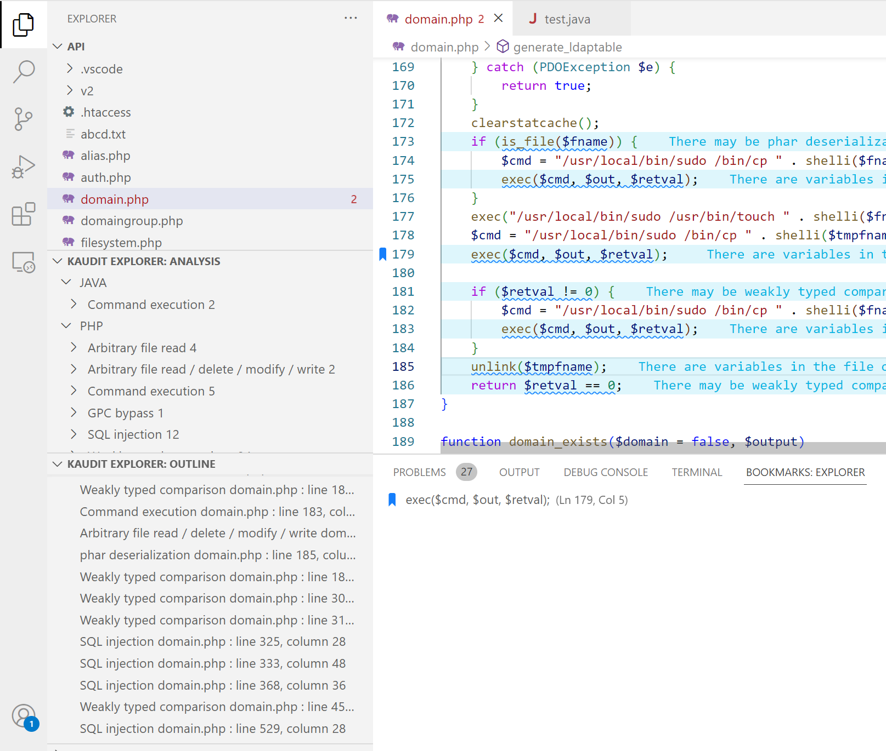

# Kaudit

> VSCode plugin,  auxiliary for source code audit

English | [简体中文](README.zh-CN.md)

## Introduction

A simple source code audit tool based on regex match

* Extension based on the `Maudit` audit rule
  * Redefine the underlying rule model
  * Supports priority ordering of rules to control the display ordering of matching results
* The default RE matching rules come from `Maudit`, but provide custom rule extensions
* Provides language and vulnerability type classification navigation
* Provides OUTLINE for per-page navigation


## Install

* Search for `kaduit` from the VSCode store and install

* Source installation

  ```
  git clone https://github.com/urn1ce/vscode-kaudit.git
  cd vscode-kaudit
  npm install
  npm install -g vsce
  vsce package
  ```

  Select the VSIX file installation from the VScode extension page menu
  
* It is recommended to install the `Error Lens` plug-in to display the description of the matching rule in the matching line (optional)

* It is recommended to install the `Output Colorizer` plugin. The console output will provide color differentiation (optional).

* It is recommended to install the `Bookmarks` plugin, mark the location of interest

## Quick Start

Open the `php/perl/python/java` source project, click the refresh button in the upper right corner of the kaudit panel, and the workspace  analysis will begin.

> Tips:You can drag and drop the tree view into the default Explorer to make it easier to browse files and match records in one panel



## Custom Rules

`CustomRules` can be defined in `Kaudit Configuration`, and `SupportLangs` support needs to be added if the rules match a language other than `php/perl/python/java`


SupportLangs Format:

```js
"conf.Kaudit.supportLangs": {   
        "java": [
            "java"
        ],
        "perl": [
            "pl",
            "pm"
        ],
        "php": [
            "php",
            "php3",
            "php4",
            "php5",
            "php6",
            "php7",
            "pht",
            "phtml"
        ],
        "python": [
            "py"
        ]
    }
```

CustomRules Format:

```js
"conf.Kaudit.customRules":{
    "php": [
        	{
                "group_name": "SQL insert operation",
                "regex": "\\binsert\\b",
                "regex_flag": "ig",
                "regex_match_cond": {
                    "context_aware_match":{
                        "match_mode":"all",
                        "context_aware_rules":{
                            "anyKeyName1ofContext_aware_rules": {
                                "range_begin":"0",
                                "range_end":"0",
                                "match_mode":"!all",
                                "cond_rules":{
                                    "anyKeyName1ofCond_rules":"\\s*(#|//|/\\*).*\\binsert\\b"
                                },
                                "cond_rules_flag":{
                                    "anyKeyName1ofCond_rules":"ig"
                                }
                            },
                            "anyKeyName2ofContext_aware_rules": {
                                "range_begin":"0",
                                "range_end":"4",
                                "match_mode":"any",
                                "cond_rules":{
                                    "anyKeyName1ofCond_rules":"\\binto\\b.+(\\$|[a-zA-Z_0-9]+\\s*\\().+",
                                    "anyKeyName2ofCond_rules":"(:?(\\$|[a-zA-Z_0-9]+\\s*\\()((?<!\\b(into)\\b).)+\\bvalues\\b)|(:?\\bvalues\\b.+(\\$|[a-zA-Z_0-9]+\\s*\\().+)"
                                },
                                "cond_rules_flag":{
                                    "anyKeyName1ofCond_rules":"ig",
                                    "anyKeyName2ofCond_rules":"ig"
                                }
                            }
                        }
                    }
                },
                "order": 1000,
                "view_info": {
                    "en": {
                        "name": "SQL insert operation",
                        "description": "Can lead to SQL injection",
                        "detail_url": ""
                    },
                    "zh": {
                        "name": "SQL插入操作",
                        "description": "可能导致SQL注入",
                        "detail_url": ""
                    }
                }
            }
    ],
    "perl": [
        {
            "group_name": "Code execution",
            "regex": "\\b(eval)\\s*?\\(.{0,100}(\\$|@)",
            "regex_match_cond": {},
            "order": 1000,
            "view_info": {
                "en": {
                    "name": "Code execution",
                    "description": "function parameter contains variables, code execution vulnerability may exist",
                    "detail_url": ""
                },
                "zh": {
                    "name": "代码执行漏洞",
                    "description": "代码执行函数中存在变量，可能存在代码执行漏洞",
                    "detail_url": ""
                }
            }
        }
    ]
}
```

 Data matched with the same `group_name` and `order`  will be grouped together

`regex` Regular rule string，row by row matching

`regex_match_cond` allowing further conditional filtering of `regex` matching results

* "range_begin":"0" indicates  `regex matched line number + 0`. The condition `range_begin` can be "negative number "/" positive number "/""(empty string indicates the beginning of the file)
* "range_end":"0" indicates  `regex matched line number + 0`. The condition `range_end` can be "negative number "/" positive number "/""(empty string indicates end of file)
* all/any/! all/! any indicates that the conditional rule match must be `all satisfied`/`any satisfied`/`none satisfied`/`at least one unsatisfied` in range `range_begin-range_end`
* Meaning of condition matching: First of all, cond_rules are matched by row. Secondly, a cond_rule  does not need to match all rows in the range, but only one row match is ok.Then, whether the cond_rules formed by cond_rule satisfy all/any/! all/!any, If yes, cond_rules matches. Finally, whether the context_aware_match's cond_rules matches all/any/! all/! any. If yes, it matches.

`view_info` Used to display prompt information

Note: All fields in the rule are required to exist

## Thanks

The code structure and rules of the following items are referenced

* [Maudit](https://github.com/m4yfly/vscode-maudit)

## License

AGPL-3.0

**Enjoy!**
