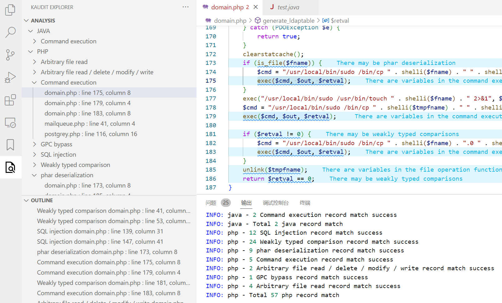
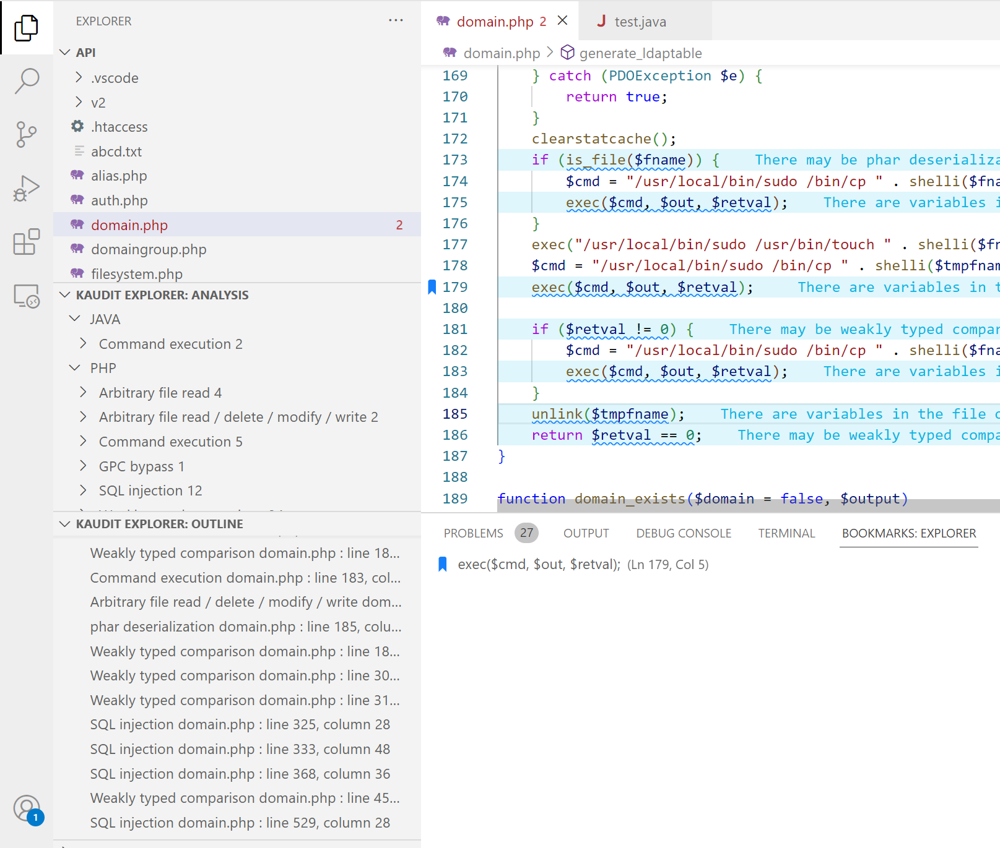

# Kaudit

> VSCode插件，辅助源码审计

简体中文 | [English](README.md)

## 简介

基于正则规则匹配的源码审计工具

* 基于 `Maudit` 审计规则进行扩展
  * 重新定义底层规则模型
  * 支持规则的优先级排序，控制匹配结果的显示排序
* 默认正则匹配规则来自 `Maudit` ,但提供自定义规则扩展
* 提供语言以及漏洞类型分类导航
* 提供OUTLINE页内导航



## 安装

* 从VSCode商店搜索 `kaduit`安装

* 源码安装

  ```
  git clone https://github.com/urn1ce/vscode-kaudit.git
  cd vscode-kaudit
  npm install
  npm install -g vsce
  vsce package
  ```

  从VScode扩展页面菜单选择VSIX文件安装
  
* 建议安装 `Error Lens`插件，匹配行显示匹配规则的description信息(可选)

* 建议安装 `Output Colorizer`插件，控制台输出将提供颜色区分(可选)

* 建议安装 `Bookmarks`插件，标记感兴趣的位置

## 快速开始

打开包含 `php/perl/python/java` 源码项目，点击插件界面右上角的刷新按钮，即会对工作空间开始匹配分析

> Tips: 可以拖拽树视图放置到默认的资源管理器中，这样文件浏览和匹配记录浏览在一个界面会比较方便



## 自定义规则

可以在 `Kaudit Configuration`中通过 `CustomRules`自定义规则，如果要扩展的规则不属于 `php/perl/python/java`，那么还需要添加 `SupportLangs`配置


SupportLangs Format:

```js
"conf.Kaudit.supportLangs": {   
        "java": [
            "java"
        ],
        "perl": [
            "pl",
            "pm"
        ],
        "php": [
            "php",
            "php3",
            "php4",
            "php5",
            "php6",
            "php7",
            "pht",
            "phtml"
        ],
        "python": [
            "py"
        ]
    }
```

CustomRules Format:

```js
"conf.Kaudit.customRules":{
    "php": [
        	{
                "group_name": "SQL insert operation",
                "regex": "\\binsert\\b",
                "regex_flag": "ig",
                "regex_match_cond": {
                    "context_aware_match":{
                        "match_mode":"all",
                        "context_aware_rules":{
                            "anyKeyName1ofContext_aware_rules": {
                                "range_begin":"0",
                                "range_end":"0",
                                "match_mode":"!all",
                                "cond_rules":{
                                    "anyKeyName1ofCond_rules":"\\s*(#|//|/\\*).*\\binsert\\b"
                                },
                                "cond_rules_flag":{
                                    "anyKeyName1ofCond_rules":"ig"
                                }
                            },
                            "anyKeyName2ofContext_aware_rules": {
                                "range_begin":"0",
                                "range_end":"4",
                                "match_mode":"any",
                                "cond_rules":{
                                    "anyKeyName1ofCond_rules":"\\binto\\b.+(\\$|[a-zA-Z_0-9]+\\s*\\().+",
                                    "anyKeyName2ofCond_rules":"(:?(\\$|[a-zA-Z_0-9]+\\s*\\()((?<!\\b(into)\\b).)+\\bvalues\\b)|(:?\\bvalues\\b.+(\\$|[a-zA-Z_0-9]+\\s*\\().+)"
                                },
                                "cond_rules_flag":{
                                    "anyKeyName1ofCond_rules":"ig",
                                    "anyKeyName2ofCond_rules":"ig"
                                }
                            }
                        }
                    }
                },
                "order": 1000,
                "view_info": {
                    "en": {
                        "name": "SQL insert operation",
                        "description": "Can lead to SQL injection",
                        "detail_url": ""
                    },
                    "zh": {
                        "name": "SQL插入操作",
                        "description": "可能导致SQL注入",
                        "detail_url": ""
                    }
                }
            }
    ],
    "perl": [
        {
            "group_name": "Code execution",
            "regex": "\\b(eval)\\s*?\\(.{0,100}(\\$|@)",
            "regex_match_cond": {},
            "order": 1000,
            "view_info": {
                "en": {
                    "name": "Code execution",
                    "description": "function parameter contains variables, code execution vulnerability may exist",
                    "detail_url": ""
                },
                "zh": {
                    "name": "代码执行漏洞",
                    "description": "代码执行函数中存在变量，可能存在代码执行漏洞",
                    "detail_url": ""
                }
            }
        }
    ]
}
```

`group_name` 相同且`order `相同的规则匹配到的数据会被分组在一起

`regex` 按行匹配的正则pattern

`regex_match_cond`  规则，允许对 `regex` 匹配的结果进一步条件过滤

* "range_begin":"0" 表示从`regex` 匹配行行号+0  开始条件匹配，可以为"负数"/"正数"/""(空字符串表示文件开头)
* "range_end":"0"    表示从`regex` 匹配行行号+0  结束条件匹配，可以为"负数"/"正数"/""(空字符串表示文件结束)
* all/any/!all/!any表示条件规则匹配要在`range_begin-range_end` 全满足/任一满足/全不满足/至少有一个不满足
* 条件匹配满足的含义：首先cond_rule都是按行匹配，其次一个cond_rule条件规则不需要匹配所有range范围内的行，而是range范围内能匹配一行就算该条cond_rule匹配，再然后cond_rule构成的cond_rules是否满足all/any/!all/!any，如果满足则cond_rules匹配，最后所有cond_rules构成的context_aware_match是否满足all/any/!all/!any，如果满足则匹配

`view_info` 用于展示提示信息

注意: 所有规则字段都要求存在

## 感谢

参考了以下项目的代码结构和规则

* [maudit](https://github.com/m4yfly/vscode-maudit)

## License

AGPL-3.0

**Enjoy!**
